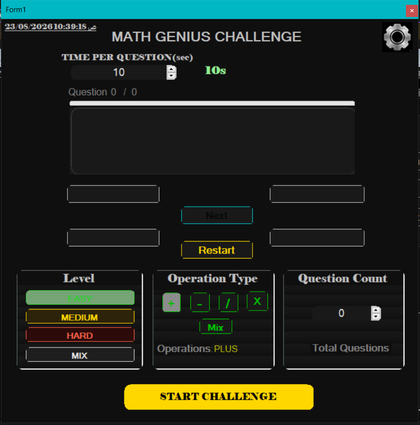

<div align="center">

# 🧠 Math Genius Challenge

[](https://docs.microsoft.com/en-us/dotnet/csharp/)
[](https://dotnet.microsoft.com/)
[](https://github.com/)
[](LICENSE.txt)

<p align="center">
  <b>A modern and interactive math challenge game designed to boost mental arithmetic skills with an engaging, user-friendly UI for all ages.</b>
</p>

[📌 Overview](#-overview) •
[✨ Key Features](#-key-features) •
[📸 Screenshots](#-screenshots) •
[🛠️ Architecture & Design](#️-architecture--design) •
[🚀 Getting Started](#-getting-started) •
[📞 Contact & Connect](#-contact--connect)

---

</div>

## 📌 Overview

**Math Genius Challenge** is a complete refactoring and modernized desktop application evolved from an earlier C++ implementation. Ported to `C#` and `WinForms`, the app elevates user experience (UX) by combining simplicity, responsive controls, and fluid performance to deliver a competitive learning environment for kids and adults alike.

---

## ✨ Key Features

* 🎯 **Single-Selection Logic:** Custom RadioButtons styled as standard buttons to enforce precise, single-option selection.
* ⏱️ **Per-Question Timer:** Built-in countdown timer (in seconds) for every question to heighten competitive challenge.
* 🎨 **Modern Rounded UI:** Custom GDI+ rendering for smooth, rounded control borders and clean dark-theme aesthetic.
* 📊 **In-App Results Panel:** Embedded performance view displaying final scores without spawning extra window forms.
* 🎵 **Audio Feedback:** Dynamic background sound effects and audio feedback for an immersive game loop.
* ⚙️ **Customizable Game Modes:** Configurable arithmetic operators (Addition, Subtraction, Multiplication, Division, or Mixed) with difficulty levels and question counts.

---

## 📸 Screenshots

<div align="center">

| Main Game Interface |
| :---: |
|  |

</div>

---

## 🛠️ Architecture & Design

Built with a strict focus on **Clean Code** principles and scalable architecture:

* 🧩 **Unified Event Handling:** Leveraged single event handlers across answer option controls to eliminate boilerplate code and adhere to the DRY (Don't Repeat Yourself) principle.
* 📐 **Custom Dynamic UI Helper (`ClsUlcs`):** Created a dedicated UI class featuring generic helper functions to apply border radii, themes, and dynamic styling across `RadioButton`, `Button`, and `Panel` controls effortlessly.

---

## 🚀 Getting Started

### Prerequisites
* **Visual Studio 2019** or newer.
* **.NET Framework 4.8** or higher.

### Installation & Execution
1. **Clone the repository:**
   ```bash
   git clone [https://github.com/aimanameenmohammed/MyMathGame.git](https://github.com/aimanameenmohammed/MyMathGame.git)
